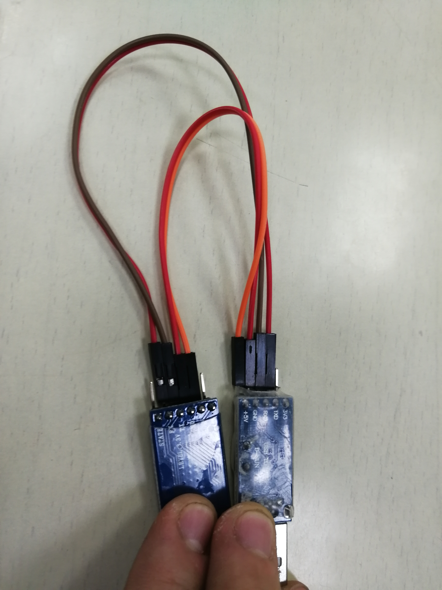

# Using Your Mobile Phone as the Mouse to Control Your Computer  
## Developer  
 - Minghao Gou, School of Mechanical Engineering, Shanghai Jiao Tong University  
 - Panzheng Zhou, School of Chemistry, Shanghai Jiao Tong University  
 - Jiangtong Li, Zhiyuan College, Shanghai Jiao Tong University  
 - Ruihao liu, School of Biomedical Engineering, Shanghai Jiao Tong University  
 - Peihan Zhang, School of Mechanical Engineering, Shanghai Jiao Tong University  
## How It Works  
### Acceleration data  
We use the accelerometer in the mobile phone with Android operating system.
We use API provided by the operating system to read the accelerometer data.

### Problem in Calculating Velocity of the Mouse  
In theory, the integration of acceleration is velocity.
However, this may not make sense in practice.
There is some bias and error with the sensor and the stimulation of small error in acceleration may lead to tremendous error in velocity.
In addition, the sum of discrete sampling of acceleration is different from the integration of continious acceleration.
There is also some error caused by discrete sampling.
As a result, the common way to calculate velocity has great problem and needs to be inproved.
### Solutions  
In order to solve the problem above, we proposed several solutions.
 - Kalman filter is applied on the acceletation data.  
 - Calibration is applied before using the system to decrease caused by the sensor bias.  
 - Attenuation of velocity is exerted to avoid divergency of velocity.  
 - Activation function is used to alleviate the backlash.  
#### Kalman filter  
Kalman filter is usually used in dealing with inertial sensor data to remove noise.
It's based on the prediction of the next state.  
```python
ax, xVar = kalmanFilter(ax,xPreData,xVar,Q,R)
ay, yVar = kalmanFilter(ay,yPreData,yVar,Q,R)
```
#### Calibration  
Before using the system, the user should put the mobile phone in the working surface.
Then the system set the zero of acceleration to the mean value of static sensor data.
After this step, the effect of inclination of the surface and the sensor bias is conpensated.  
```python
ax = x0int / 32.0 * 9.8 - axave
ay = y0int / 32.0 * 9.8 - ayave
```
#### Attenuation of Velocity  
We let the velocity damps with a constant rate so that the velocity will convergent even the integration of acceleration divergent.
```python
# damp the speed
vx = vx * dampRate
vy = vy * dampRate
```
#### Activation function
There will be backlash when stop moving the mouse because of the huge reverse acceleration.
It always causes the cursor to move backward which is not expected.  
Therefore, we desigend an activation function to change the effect of accleration on the change of velocity.
When the velocity is very small, the cursor is static and there is no problem of backlash.
As a result, the acceleration should have great effect on the change of velocity.
On the contrary, when the cursor is moving fast, huge acceleration is usually cause by stopping the mouse.
So the acceleratiou shouldn't have a big enough impact on velocty or there will be backlash.
In our design, the change of velocity is decided by several factors as shown below:
```python
dvx = np.exp(-abs(vx)) * ax * v
dvy = np.exp(-abs(vy)) * ay * v
```
dv is the change of velocity, np.exp is the exponential function provided by numpy package in python, a is the acceleration and v is a constant to magify the relative speed which is specified by the user.  
As we can see, dv decreases with the increase of the absolute value of v. 
## Communcation Protocal  

### Hardware  
The phone establishes a bluetooth with the HC-05 Bluetooth chip. Then the chip is connected to USBtoTTL converter while 4 wires.
The USBtoTTL converter is inserted into the USB port in the computer. As a result, the data is converted to serial communication byte in the computer.  
### Encoding  
<p>The data to be transmitted can be devided into Three groups.  
 - Acceleration data.  
 - Mouse click data.  
 - Begin, stop and check byte.  
</p>
<p>We established the following encoding method for these data.</p>
<p><b>1. X Axis Acceleration Data High Byte(XH)</b></p>
<p><center>XT = g<sub>x</sub> / 9.8 * 32</center></p>
<p><center>XH = 128 + floor(XT)</center></p>
<p>g<sub>x</sub> can be both positive and negative so we add 128 to the original value. According to the expression, the absolute value for g <sub>x</sub> should be no more than 4g, or overflow will happen.</p>
<p><b>2. X Axis Acceleration Data Low Byte(XL)</b></p>
<p><center>XL = floor(256 * (XT - floor(XT)))</center></p>

<p><b>3. Y Axis Acceleration Data High Byte(YH)</b></p>
<p><center>YT = g<sub>y</sub> / 9.8 * 32</center></p>
<p><center>YH = 128 + floor(YT)</center></p>
<p><b>4. Y Axis Acceleration Data Low Byte(YL)</b></p>
<p><center>YL = floor(256 * (YT - floor(YT)))</center></p>

<p><b>5. Z Axis Acceleration Data High Byte(ZH)</b></p>
<p><center>ZT = g<sub>z</sub> / 9.8 * 32</center></p>
<p><center>ZH = 128 + floor(ZT)</center></p>
<p><b>6. Z Axis Acceleration Data Low Byte(ZL)</b></p>
<p><center>ZL = floor(256 * (ZT - floor(ZT)))</center></p>
<p><b>7. Left Button Down(LD)</b></p>
<p><center>LD = 0x00</center></p>
<p><b>8. Left Buttom Up(LU) </b></p>
<p><center>LU = 0x01</center></p>
<p><b>9. Right Button Down(RD)</b></p>
<p><center>RD = 0xFF</center></p>
<p><b>10. Right Button Up(RU)</b></p>
<p><center>RU = 0xFE</center></p>
<p><b>11. Begin Acceleration Data Transmission(BT)</b></p>
<p><center>BT = 0x16</center></p>
<p><b>12. Finish X Axis Data Transmission(FX)</b></p>
<p><center>FX = 0x17</center></p>
<p><b>13. Finish Y Axis Data Transmission(FY)</b></p>
<p><center>FY = 0x18</center></p>
<p><b>14. Finish Z Axis Data Transmission(FZ)</b></p>
<p><center>FZ = 0x19</center></p>

### Encoding Method with Check  
<p>There might be error in transmission.
So we apply Check byte to minimize the error.
The Byte sequence is shown below.</p>
<p><b>1. Acceleration Data</b></p>
<p><center>| BT | XH | XL | FX | YH | YL | FY | ZH | ZL | FZ |</center></p>
<p><b>2. Left Button Down</b></p>
<p><center>| LD | LD |</center></p>
<p><b>3. Left Button Up</b></p>
<p><center>| LU | LU |</center></p>
<p><b>4. Right Button Down</b></p>
<p><center>| RD | RD |</center></p>
<p><b>5. Right Button Up</b></p>
<p><center>| RU | RU |</center></p>

<p>For acclerationg data transmission, we can check the FX, FY and FZ to check if the sequence is complete. For click, the acceleration data can also be the value of LD, LU, RD and RU. So we send two bytes to check if it is really click signal although there is some remote chance that the acceleration data have two consecutive LD, LU, RD or RU. Besides, we set LD, LU, RD and RU to 0x00, 0x01, 0xFF and 0xFE respectively because they are the most improbable bytes to appear in acceleration data.</p>

### Encoding Method without Check  
<p>The encoding method with check ninimize the possibility of occurrence of error.
But it conusmes to much time, either.
This reduces the transmission rate and leads to bad proformance of the system, we also introduce an encoding method without check.
This method reduces the bytes to be transmitted and accelerates the transmission.
In our test, we haven't find any error till now even if we didn't check the byte.</p>

<p><b>1. Acceleration Data</b></p>
<p><center>| BT | XH | YH |</center></p>
<p><b>2. Left Button Down</b></p>
<p><center>| LD |</center></p>
<p><b>3. Left Button Up</b></p>
<p><center>| LU |</center></p>
<p><b>4. Right Button Down</b></p>
<p><center>| RD |</center></p>
<p><b>5. Right Button Up</b></p>
<p><center>| RU |</center></p>

<p> This is the fewest bytes to be transmitted or the data will be incomplete.
You can see that we do not transmit the z axis data because we don't quiet need it. The low byte for x axis data and y axis data are also ingored. This increases the transmission speed while decreases the accurace. In our test, the decrease of accuracy donesn't lead to a major problem.</p>

## Running Requirement  

### Mobile Phone  
 - Phone with Android OS is required.(tested on EMUI 8.0.0(Huawei))  
 - Phone with bluetooth 4 is required or it cannot communicate with conputer  

### Computer  
 - PC with Windows OS is required.(tested on Windows 10 Pro)  
 - PC with python environment is required.(tested on python 3.5)  
 - Python package numpy, serial, win32api and win32con are required.(tested using Anaconda 5.1.0(Python 3.5))  

## Setup  
### Mobile Phone  
Install the csNetworkNewbeta.apk APP on your Android phone and open the bluetooth on system setting.  
### Computer  
Insert a external bluetooth in your USB port.
In the test, we use HC-05 bluetooth module and a ttl serial port to usb converter.
The connection is shown in the picture below.
<center></center>
<center>
<p>HC-05---------TTL to USB converter</p>
<p>5V ----------------------- 5V</p>
<p>GND --------------------- GND</p>
<p>TX ----------------------- RX</p>
<p>RX ----------------------- TX</p>
</center>
Set the path to the root folder that contains driver.py  

## Run  
### Phone  
Open the "Xiao" APP and click the "Connect to BlueTooth" button then choooe the bluetooth device conneted to your PC.  
**We should pay attention that this step must be done before run the python written driver program.**  
<center></center>

### Computer  
Run the command as follows:
```cmd
python driver.py (serial port number) [(cursor move speed)] [(threshhold for moving)] [(damp rate)] [(Q)] [(R)]
```
We can just give the first few parameters that is included in '[' and ']' and the parameters will be set the default value. 
Some of the few examples are given below:
```cmd
python driver.py COM3 20 
python driver.py COM3 20 0.4
python driver.py COM3 20 0.4 0.8
python driver.py COM3 20 0.4 0.8 0.1
python driver.py COM3 20 0.4 0.8 0.1 0.25
```
These values are also the default value and as a result, these commands have the same effect.  

### Calibration
Make sure that the xiao APP is running without lock the screen when the program begins and put the mobile phone on the surface where you want to use this program.  
The program will print some of the information and after that it's available to use the mouse to control your computer.
