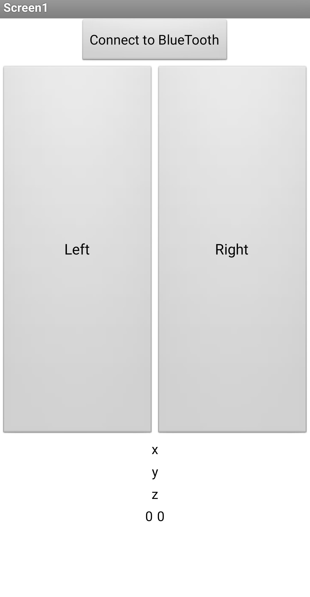

# Using Your Mobile Phone as the Mouse to Control Your PC  

## Requirement  

### Mobile Phone  
 - Phone with Android OS is required.(tested on EMUI 8.0.0(Huawei))  
 - Phone with bluetooth 4 is required or it cannot communicate with conputer  

### Computer  
 - PC with Windows OS is required.(tested on Windows 10 Pro)  
 - PC with python environment is required.(tested on python 3.5)  
 - Python package numpy, serial, win32api and win32con are required.(tested using Anaconda 5.1.0(Python 3.5))  

## Setup  
### Mobile Phone  
Install the csNetworkNewbeta.apk APP on your Android phone and open the bluetooth on system setting.  
### Computer  
Insert a external bluetooth in your USB port.
In the test, we use HC-05 bluetooth module and a ttl serial port to usb converter.
The connection is shown in the picture below.
  
HC-05---------TTL to USB converter  
5V ----------------------- 5V  
GND --------------------- GND  
TX ----------------------- RX  
RX ----------------------- TX  
  
Set the path to the root folder that contains driver.py  

## Run  
### Phone  
Open the "Xiao" APP and click the "Connect to BlueTooth" button then choooe the bluetooth device conneted to your PC.  
**We should pay attention that this step must be done before run the python written driver program.**  
  

### Computer  
Run the command as follows:
```cmd
python driver.py (serial port number) [(cursor move speed)] [(threshhold for moving)] [(damp rate)] [(Q)] [(R)]
```
We can just give the first few parameters that is included in '[' and ']' and the parameters will be set the default value. 
Some of the few examples are given below:
```cmd
python driver.py COM3 20 
python driver.py COM3 20 0.4
python driver.py COM3 20 0.4 0.8
python driver.py COM3 20 0.4 0.8 0.1
python driver.py COM3 20 0.4 0.8 0.1 0.25
```
These values are also the default value and as a result, these commands have the same effect.  

### Calibration
Make sure that the xiao APP is running without lock the screen when the program begins and put the mobile phone on the surface where you want to use this program.  
The program will print some of the information and after that it's available to use the mouse to control your computer.
